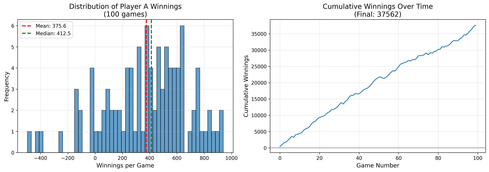

# reference-1-2026
First reference bot 2026

This bot (written in `python_toss_smallest`) implements the default strategy for betting, but always tosses the card with the lowest rank. Running 100 games against the default skeleton bot got the following score distribution: 

As we can see, on average this bot beats the skeleton, winning >80% of the time.
